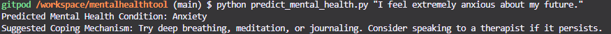
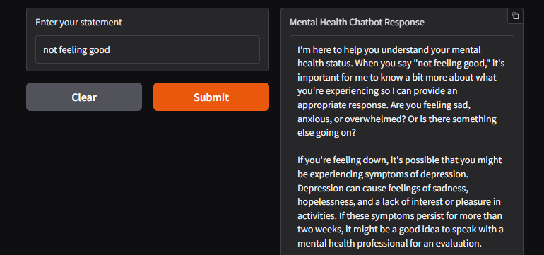

# Mental Health Analysis Tool

This project provides a tool for analyzing mental health based on user-provided statements. It uses machine learning techniques for prediction and provides insights into potential mental health conditions and sentiment.

## Table of Contents

1.  [Overview](#overview)
2.  [Dataset Preprocessing Steps](#dataset-preprocessing-steps)
3.  [Model Selection Rationale](#model-selection-rationale)
4.  [How to Run the Inference Script](#how-to-run-the-inference-script)
5.  [UI/CLI Usage Instructions](#uicli-usage-instructions)
6.  [Dependencies](#dependencies)

## 1. Overview

This tool takes a statement as input and predicts the user's mental health condition (e.g., Anxiety, Depression, Stress, Neutral) and the sentiment of the statement (Positive, Negative, Neutral).  It then offers basic coping advice and connects to a large language model to provide detailed and personalized assistance.

## 2. Dataset Preprocessing Steps

Dataset Used: Sarkar, Suchintika (2024), "Sentiment Analysis for Mental Health", Kaggle.

The dataset used for training the model went through the following preprocessing steps:

1.  **Data Loading:** The dataset (CSV file) was loaded into a Pandas DataFrame.
2.  **Handling Missing Values:** Rows with missing values were removed using `dropna()` to ensure data completeness.
3.  **Sentiment Analysis:**  The VADER sentiment analyzer was used to determine the sentiment (Positive, Negative, Neutral) of each statement and create a sentiment score.  These sentiment scores became new features.
4.  **Feature Engineering:**  The "statement" column, mental health status, and sentiment analysis were converted into feature vectors suitable for machine learning.
5. The dataset has 53403 rows with columns containing a statement and the mental health status associated with the statement. It contained 362 rows where the statement was null. After dropping rows with null values, the total number of entries is 52681.
6. The test size was 25% for y_status and 30% for y_sentiment.


## 3. Model Selection Rationale

*   **TF-IDF Vectorization:** Used to convert text data into numerical feature vectors, which can be used for machine learning models.
*   **Linear Support Vector Classification (LinearSVC):** First model of choice due to high accuracy and low computing power.
*   **Random Forest Classifier**: Another model tested to improve prediction accuracy, although performed worse than LinearSVC.
*   **Groq LLM:** Finally implemented to add a level of complexity, and personalized coping strategies.

## 4. How to Run the Inference Script

To run the inference script and get a prediction for a new statement, follow these steps:

1.  **Ensure the required libraries are installed:**
    ```
    pip install scikit-learn pandas nltk
    ```
2.  **Save the `predict_mental_health.py` script:** Save the script to a file named `predict_mental_health.py`.
3.  **Run the script from the command line:**
    ```
    python predict_mental_health.py "Your statement here"
    ```
    Replace `"Your statement here"` with the actual statement you want to analyze.

    **Example:**
    ```
    python predict_mental_health.py "I've been feeling down and anxious lately."
    ```
4.  **Check the Output:** The script will print the predicted mental health condition and a suggested coping mechanism.

## 5. UI/CLI Usage Instructions

This project has two ways to interact with it: a command-line interface (CLI) using the inference script, and a Gradio-based user interface (UI).

### a. Command-Line Interface (CLI)

The CLI is used through the `predict_mental_health.py` script as shown in the previous section ("How to Run the Inference Script").

Eg:


### b. User Interface (UI)

The UI provides a more interactive way to use the tool through a web browser.

**Steps to Run the UI:**

1.  **Ensure the required libraries are installed:**

    ```
    pip install vaderSentiment
    pip install langchain
    pip install groq
    pip install python-dotenv
    pip install gradio
    pip install langchain-groq
    pip install scikit-learn pandas nltk lime
    ```

2.  **Set your Groq API key:**

    *   Obtain an API key from Groq.
    *   Set the `GROQ_API_KEY` environment variable in your environment or directly in the script if necessary (not recommended for security reasons).
    ```
    os.environ['GROQ_API_KEY'] = 'YOUR_GROQ_API_KEY'
    ```
3.  **Run the main Python script:**
    ```
    python your_main_script.py 
    ```
    This will launch a Gradio interface in your web browser.

4.  **Interact with the UI:**
    *   Enter your statement in the text box.
    *   Click the "Submit" button.
    *   The chatbot response, including the predicted mental health status and suggestions, will be displayed.

Eg:



## 6. Dependencies

The project relies on the following Python libraries:

*   `pandas`: For data manipulation and reading CSV files.
*   `nltk`: For sentiment analysis.
*   `scikit-learn`: For machine learning models (LinearSVC, RandomForestClassifier), TF-IDF vectorization, and train-test splitting.
*   `python-dotenv`: For loading environment variables.
*   `langchain`: For integrating with LLMs like Groq.
*   `gradio`: For creating the user interface.
*   `lime`: for model explainability
*   `pickle`: To load the saved model

You can install these dependencies using pip:


**Notes:**

*   Replace `"path/to/your/model.pkl"` with the actual path to your saved model file.
*   The Gradio interface requires a Groq API key, which should be set as an environment variable.

